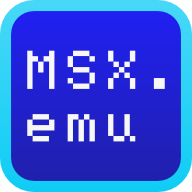
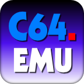
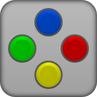
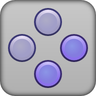
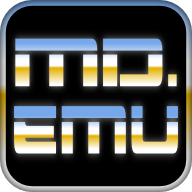

# [EX Plus Alpha](https://www.explusalpha.com/)
- [Imagine](https://www.explusalpha.com/contents/imagine) - Multi-platform game/multimedia engine
- [EmuEX](https://www.explusalpha.com/contents/emuex) - Emulator app framework ([changelog](https://www.explusalpha.com/contents/emuex/updates))
- [2600.emu](https://www.explusalpha.com/contents/2600-emu) - Atari 2600 emulator
- [C64.emu](https://www.explusalpha.com/contents/c64-emu) - Commodore 64 emulator
- [GBA.emu](https://www.explusalpha.com/contents/gba-emu) - Gameboy Advance emulator
- [GBC.emu](https://www.explusalpha.com/contents/gbc-emu) - Gameboy Color emulator
- [MD.emu](https://www.explusalpha.com/contents/md-emu) - Mega Drive/Genesis/Master System/Mark III emulator
- [MSX.emu](https://www.explusalpha.com/contents/msx-emu) - MSX computer emulator
- [NEO.emu](https://www.explusalpha.com/contents/neo-emu) - Neogeo MVS/AES emulator
- [NES.emu](https://www.explusalpha.com/contents/nes-emu) - Famicom/NES emulator
- [NGP.emu](https://www.explusalpha.com/contents/ngp-emu) - Neogeo Pocket emulator
- [PCE.emu](https://www.explusalpha.com/contents/pce-emu) - PC Engine/TurboGrafx-16 emulator
- [Snes9x EX](https://www.explusalpha.com/contents/snes9x-ex) - Super Famicom/SNES emulator
- [Atmel Flash Utility](https://www.explusalpha.com/contents/atmel-flash-utility) - Bluetooth firmware flasher (for iControlPad and other devices)
- iControlPad Update
- Puzzle Orbs
# Emulator
Play: Update app
GitHub: Backup data, Clear data, Uninstall app, UnZIP, Install app, Restore data
Brand|Source|Icon|ABI|Play|GitHub
---|---|---|---|---|---
All|All|All|All|None|[All](https://github.com/Rakashazi/emu-ex-plus-alpha/releases/download/Pre-release/EX-Emulators.zip)
3DO||||3DO.emu|3DO.emu
Acorn|||||
Amiga||||Amiga.emu|Amiga.emu
Amstrad||||CPC.emu|CPC.emu
ASCII|[blueMSX](https://sourceforge.net/projects/bluemsx/)||armeabi-v7a, arm64-v8a, x86, x86_64|[MSX.emu](https://play.google.com/store/apps/details?id=com.explusalpha.MsxEmu)|[MSX.emu](https://github.com/Rakashazi/emu-ex-plus-alpha/releases/download/Pre-release/MsxEmu.zip)
Atari|[Stella](https://github.com/stella-emu/stella)||armeabi-v7a, arm64-v8a, x86, x86_64|[2600.emu](https://play.google.com/store/apps/details?id=com.explusalpha.A2600Emu)|[2600.emu](https://github.com/Rakashazi/emu-ex-plus-alpha/releases/download/Pre-release/2600Emu.zip)
Atari||||5200.emu|5200.emu
Atari|[ProSystem Rikki & Vikki](https://github.com/tachimarten/ProSystem1_3/tree/rikki)|||7800.emu|7800.emu
Atari||||Jaguar.emu|Jaguar.emu
Atari|[Mednafen](https://github.com/mednafen/mednafen.github.io)||armeabi-v7a, arm64-v8a, x86, x86_64|[Lynx.emu](https://play.google.com/store/apps/details?id=com.explusalpha.LynxEmu)|[Lynx.emu](https://github.com/Rakashazi/emu-ex-plus-alpha/releases/download/Pre-release/LynxEmu.zip)
Atari|||||
Bandai|[eRX-78](http://takeda-toshiya.my.coocan.jp/rx78/index.html)|||RX78.emu|RX78.emu
Bandai|[Mednafen](https://github.com/mednafen/mednafen.github.io)||armeabi-v7a, arm64-v8a, x86, x86_64|[Swan.emu](https://play.google.com/store/apps/details?id=com.explusalpha.SwanEmu)|[Swan.emu](https://github.com/Rakashazi/emu-ex-plus-alpha/releases/download/Pre-release/SwanEmu.zip)
BBC|||||
Casio|[ePV-1000](http://takeda-toshiya.my.coocan.jp/pv1000/index.html)|||PV-1000|PV-1000
Casio|[EmuGaki](http://takeda-toshiya.my.coocan.jp/pv2000/index.html)|||PV-2000|PV-2000
CBM|[VICE](https://sourceforge.net/projects/vice-emu/)||armeabi-v7a, arm64-v8a, x86, x86_64|[C64.emu](https://play.google.com/store/apps/details?id=com.explusalpha.C64Emu)|[C64.emu](https://github.com/Rakashazi/emu-ex-plus-alpha/releases/download/Pre-release/C64Emu.zip)
Epoch|[eSCV](http://takeda-toshiya.my.coocan.jp/scv/index.html)|||SCV.emu|SCV.emu
Fujitsu|[Mutsu](https://github.com/captainys/77AVEMU)|||FM7.emu|FM7.emu
Fujitsu|[Tsugaru](https://github.com/captainys/TOWNSEMU)|||FM Towns|FM Towns
Gakken|yaTVBOY|||TV Boy|TV Boy
GCE||||Vectrex|Vectrex
Magnavox||||Odyssey²|Odyssey²
Mattel||||INTV.emu|INTV.emu
NEC|[Mednafen](https://github.com/mednafen/mednafen.github.io)||armeabi-v7a, arm64-v8a, x86, x86_64|[PCE.emu](https://play.google.com/store/apps/details?id=com.PceEmu)|[PCE.emu](https://github.com/Rakashazi/emu-ex-plus-alpha/releases/download/Pre-release/PceEmu.zip)
NEC|[Mednafen](https://github.com/mednafen/mednafen.github.io)|||PCFX.emu|PCFX.emu
NEC|||||
NEC||||PC98.emu|PC98.emu
Nintendo|[FCEUX](https://github.com/TASEmulators/fceux)||armeabi-v7a, arm64-v8a, x86, x86_64|[NES.emu](https://play.google.com/store/apps/details?id=com.explusalpha.NesEmu)|[NES.emu](https://github.com/Rakashazi/emu-ex-plus-alpha/releases/download/Pre-release/NesEmu.zip)
Nintendo|[Snes9x](https://github.com/snes9xgit/snes9x)||armeabi-v7a, arm64-v8a, x86, x86_64|[Snes9x EX+](https://play.google.com/store/apps/details?id=com.explusalpha.Snes9xPlus)|[Snes9x EX+](https://github.com/Rakashazi/emu-ex-plus-alpha/releases/download/Pre-release/Snes9xEXPlus.zip)
Nintendo|[Snes9x](https://github.com/snes9xgit/snes9x)||armeabi-v7a||[Snes9x EX](https://github.com/Rakashazi/emu-ex-plus-alpha/releases/download/Pre-release/Snes9xEX-9.zip)
Nintendo|[Snes9x](https://github.com/snes9xgit/snes9x)||x86||[Snes9x EX](https://github.com/Rakashazi/emu-ex-plus-alpha/releases/download/Pre-release/Snes9xEX-15.zip)
Nintendo|[Gambatte](https://sourceforge.net/projects/gambatte/)||armeabi-v7a, arm64-v8a, x86, x86_64|[GBC.emu](https://play.google.com/store/apps/details?id=com.explusalpha.GbcEmu)|[GBC.emu](https://github.com/Rakashazi/emu-ex-plus-alpha/releases/download/Pre-release/GbcEmu.zip)
Nintendo|[Mednafen](https://github.com/mednafen/mednafen.github.io)|||VB.emu|VB.emu
Nintendo|[VBA-M](https://github.com/visualboyadvance-m/visualboyadvance-m)||armeabi-v7a, arm64-v8a, x86, x86_64|[GBA.emu](https://play.google.com/store/apps/details?id=com.explusalpha.GbaEmu)|[GBA.emu](https://github.com/Rakashazi/emu-ex-plus-alpha/releases/download/Pre-release/GbaEmu.zip)
Nintendo||||Pokémon mini|Pokémon mini
Philips||||CDi.emu|CDi.emu
Philips|[M2000](https://github.com/p2000t/M2000)|||P2000|P2000
Qualcomm|[Infuse](Open source in the future)|||BREW.emu|BREW.emu
SEGA|Genesis Plus||armeabi-v7a, arm64-v8a, x86, x86_64|[MD.emu](https://play.google.com/store/apps/details?id=com.explusalpha.MdEmu)|[MD.emu](https://github.com/Rakashazi/emu-ex-plus-alpha/releases/download/Pre-release/MdEmu.zip)
SEGA|[Mednafen](https://github.com/mednafen/mednafen.github.io)||arm64-v8a, x86_64|[Saturn.emu](https://play.google.com/store/apps/details?id=com.explusalpha.SaturnEmu)|[Saturn.emu](https://github.com/Rakashazi/emu-ex-plus-alpha/releases/download/Pre-release/SaturnEmu.zip)
Sharp||||MZ.emu|MZ.emu
Sharp|[eX1](http://takeda-toshiya.my.coocan.jp/x1twin/index.html)|||X1.emu|X1.emu
Sharp||||X68000|X68000
Sinclair|[EightyOne](https://sourceforge.net/projects/eightyone-sinclair-emulator/)|||ZX.emu|ZX.emu
SNK|[Gngeo](https://github.com/pepone42/gngeo)||armeabi-v7a, arm64-v8a, x86, x86_64|[NEO.emu](https://play.google.com/store/apps/details?id=com.explusalpha.NeoEmu)|[NEO.emu](https://github.com/Rakashazi/emu-ex-plus-alpha/releases/download/Pre-release/NeoEmu.zip)
SNK|[Mednafen](https://github.com/mednafen/mednafen.github.io)||armeabi-v7a, arm64-v8a, x86, x86_64|[NGP.emu](https://play.google.com/store/apps/details?id=com.explusalpha.NgpEmu)|[NGP.emu](https://github.com/Rakashazi/emu-ex-plus-alpha/releases/download/Pre-release/NgpEmu.zip)
SORD|[Emu5](http://takeda-toshiya.my.coocan.jp/m5/index.html)|||M5.emu|M5.emu
SORD|[Emu23](http://takeda-toshiya.my.coocan.jp/m23/index.html)|||M23.emu|M23.emu
Tomy|[ePyuTa](http://takeda-toshiya.my.coocan.jp/pyuta/index.html)|||Pyūta|Pyūta
VTech|[creatiVision](https://sourceforge.net/projects/creativisionemulator/)|||CreatiVision|CreatiVision
Watara||||SV.emu|SV.emu
Welback|[SameDuck](https://github.com/LIJI32/SameBoy/tree/SameDuck)|||Mega Duck|Mega Duck
# Contact
email: info@explusalpha.com
Play: [Robert Broglia](https://play.google.com/store/apps/developer?id=Robert+Broglia)
Youtube: [explusalpha0](https://youtube.com/@explusalpha0)
X: [Robert Broglia](https://x.com/rakashazi)
# Credit
©2024 Robert Broglia
GPL3, FLAC, MAME CHD, 7Z, ZIP
